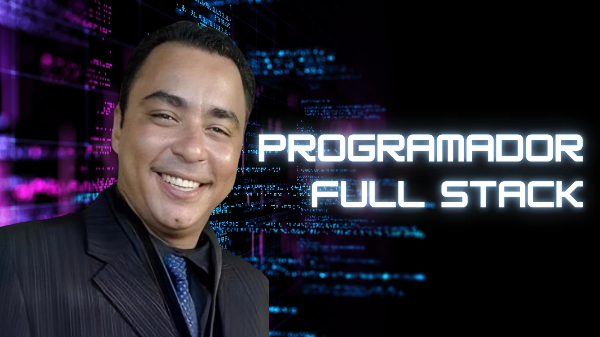
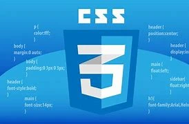
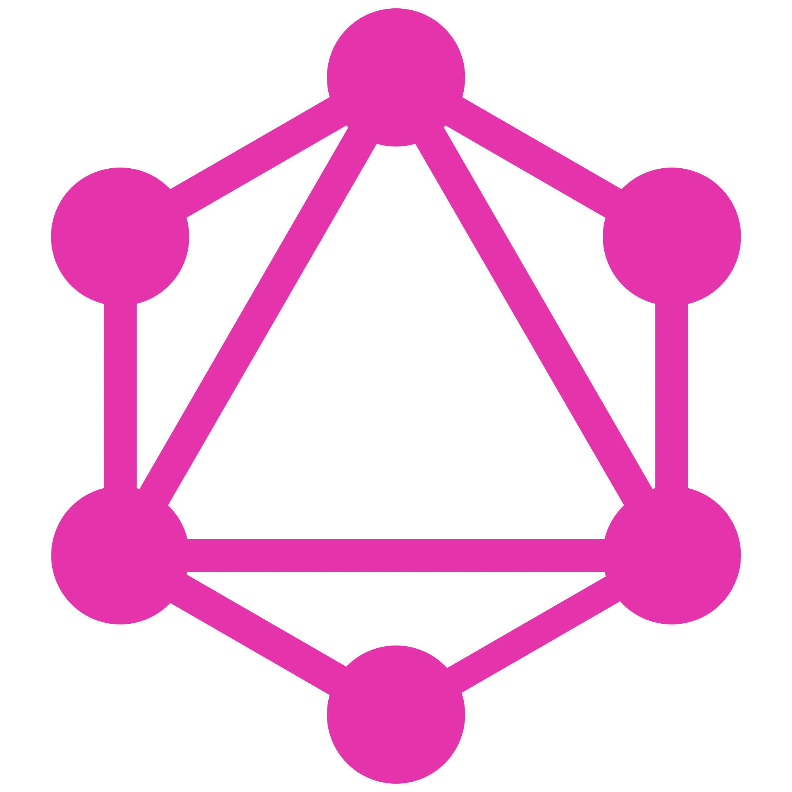
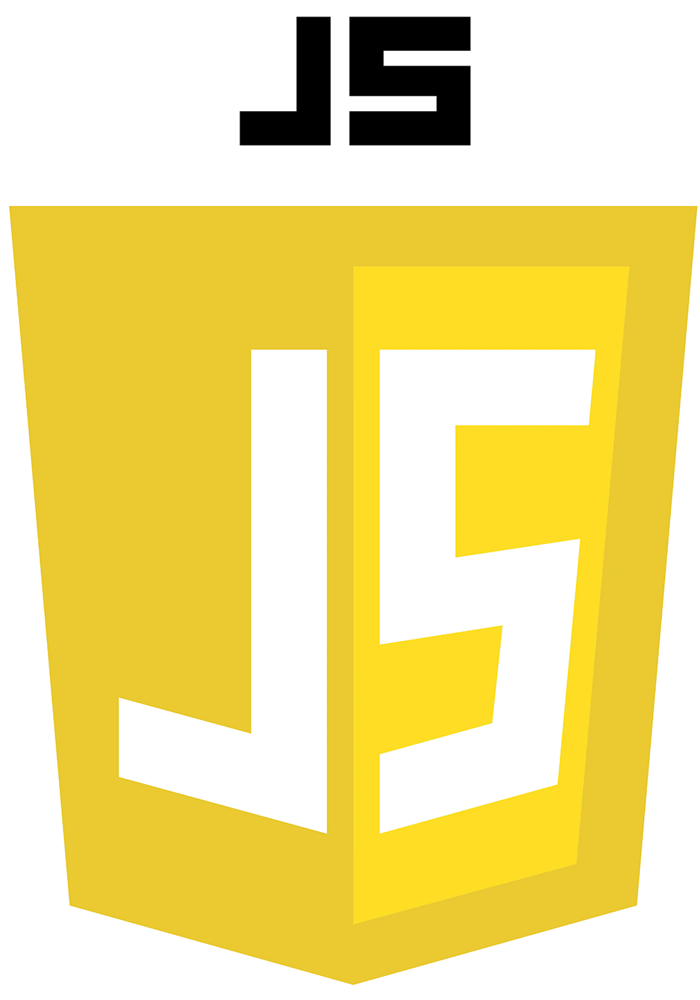
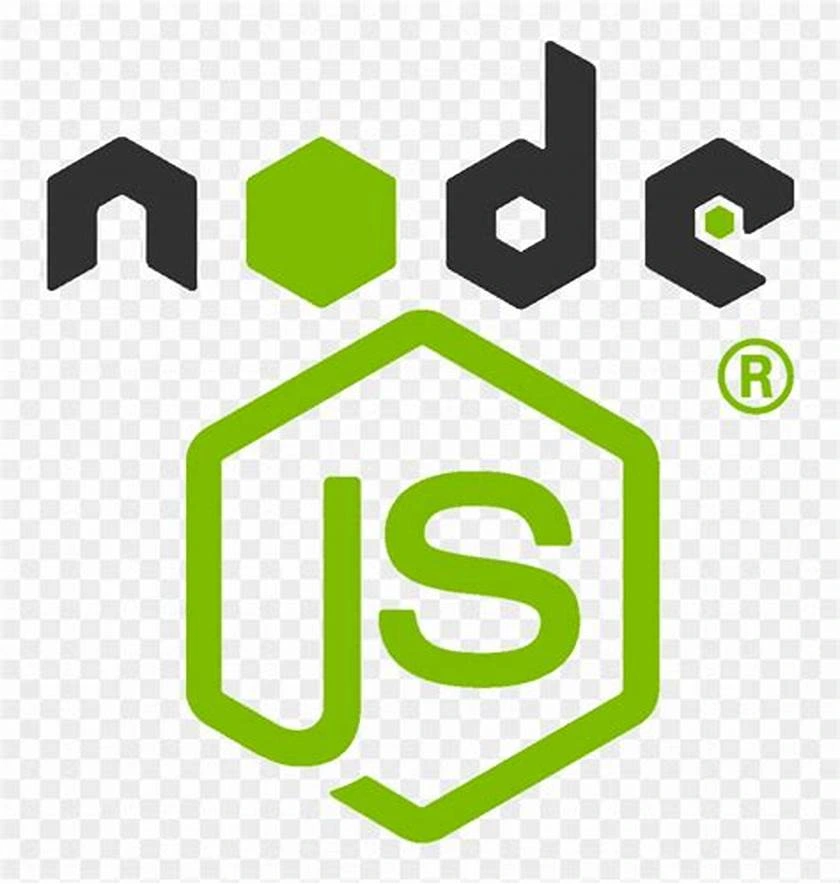
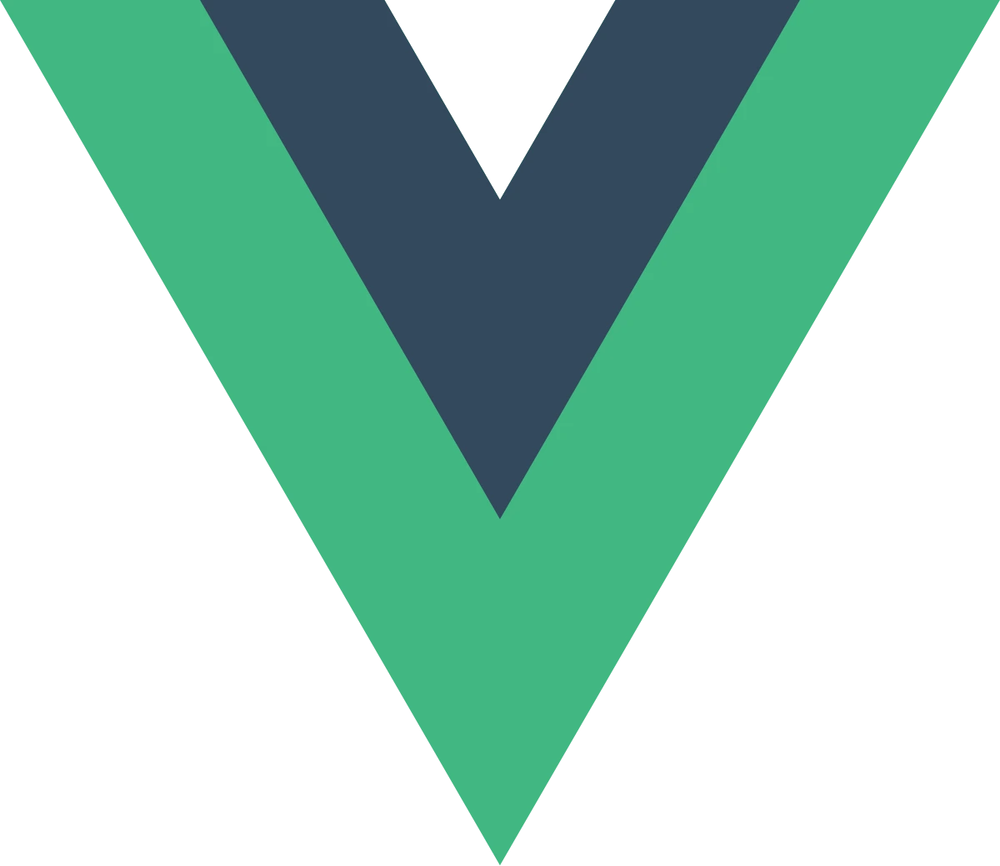
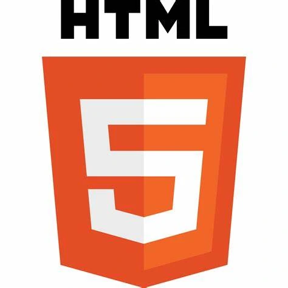

# Projeto Final de Desenvolvimento Full Stack

## Nível 5: Software Sem Segurança Não Serve

- **Faculdade Estácio de Sá**
- **Curso:** Desenvolvimento Full Stack
- **Aluno:** João Luiz Silva Tavares

---

## Botões de Navegação

<div style="display:flex; justify-content: space-around; margin: 20px 0;">
  <span style="text-align: center; margin:20px">
    <a href="#querys">Querys</a>
  </span>
  <span style="text-align: center;margin:20px">
    <a href="#mutations">Mutations</a>
  </span>
</div>

---



**João Luiz Silva Tavares**  
Durante dois anos de estudo na Faculdade Estácio de Sá, desenvolvi habilidades que me permitem criar sistemas seguros, com foco na proteção de dados e no controle de acesso robusto.

---

## Tecnologias Utilizadas

<div style="width: 100%; overflow-x: auto; margin: 20px 0;">
  <div style="display: flex; gap: 10px;">
    
    
    
    
    
    
    
  </div>
</div>

---

## Introdução

Este projeto demonstra a criação de um sistema Full Stack com foco em práticas de segurança. O objetivo é proteger dados sensíveis, implementar controle de acesso eficiente e minimizar vulnerabilidades com as melhores práticas do setor.

---

## Objetivos Técnicos da Prática

### Controle Básico de Acesso a uma API REST

- **Autenticação JWT**: Tokens garantem que apenas usuários autorizados acessem a API.

### Tratamento de Dados Sensíveis e Log de Erros

- **Hashing de Senhas**: Implementado com `bcrypt`.
- **Log Seguro de Erros**: Configurações para ocultar detalhes técnicos em mensagens de erro.

### Prevenção de Ameaças

- **Gerenciamento Seguro de Tokens**: Expiração e renovação de tokens.
- **Proteção Contra SQL Injection**: Consultas parametrizadas com `knex`.
- **Sanitização de Entradas**: Evita injeções CRLF.
- **Proteção CSRF**: Tokens de validação são usados para proteger requisições críticas.

---

## Tecnologias e Frameworks Utilizados

### Backend

- **Node.js**: Plataforma principal.
- **GraphQL com Apollo Server**: Consultas eficientes e seguras.
- **Knex.js**: Query Builder SQL.
- **JWT**: Autenticação.

### Frontend

- **Vue.js**: Framework front-end.
- **Vuetify**: Componentes de UI responsivos.

---

## Passos para a Implementação

0. **Baixe o repositórios**: 

  ```bash
   git clone git@github.com:jmoka/FACULDADE.git
   ```
  OBS. **Localizar o Repositório**:

    ```bash
    O repositório baixado é o arqquivo completo da faculdade, portanto o arquivo em questão para esse trabalho está localizado: "Quinto_Semestre_n5_m5_CadastroCliente_Trabalho_Final"
    Localize essa pasta e 'abra o VSCode nesse diretório'!
    ```

1. **Instalação das Dependências**:
   ```bash
   npm install
   ```
2. **Configuração de Variáveis de Ambiente**:  
   Crie o arquivo `.env` com as variáveis necessárias.
3. **Instale o MySQL** e configure conforme os dados de conexão fornecidos.
4. **Execução do Projeto**:
   - Iniciar o servidor de desenvolvimento:
     ```bash
     npm start
     ```
   - Fechar a aplicação:
     ```bash
     ctrl + c
     s + enter
     ```
   - Executar as migrations:
     ```bash
     knex migrate:latest
     ```
   - Executar as seeds:
     ```bash
     knex seed:run
     ```
   - Reiniciar o sistema:
     ```bash
     npm start
     ```

---

## Querys

### Consultar Todos Usuários

```graphql
query {
  usuarios {
    id
    nome
    email
    perfil {
      nome
      rotulo
    }
    status
    dataCriacao
  }
}
```

### Consultar Usuários por ID

```graphql
query {
  usuarioID(id: 1) {
    id
    nome
    email
    status
    perfil {
      id
      nome
      rotulo
    }
    dataCriacao
  }
}
```

---

## Mutations

### Login do Usuário

```graphql
mutation {
  loginUsuario(
    dados: { email: "master@jotaempresa.com", senha: "Master@123" }
  ) {
    id
    nome
    email
    status
    perfil {
      nome
      rotulo
    }
  }
}
```

### Cadastrar Usuários

```graphql
mutation {
  novoUsuario(
    user: {
      nome: "dev"
      email: "dev41@dev.com"
      senha: "123"
      perfil: 4
      status: "ATIVO"
    }
  ) {
    id
    nome
    email
    perfil {
      nome
      rotulo
    }
    status
  }
}
```

### Alterar Usuários

```graphql
mutation {
  alterarUsuario(
    user: {
      nome: "brasil2"
      email: "dev1000@dev.com"
      status: "ATIVO"
      perfil: 3
    }
    filtro: { id: 42 }
  ) {
    id
    nome
    email
  }
}
```


