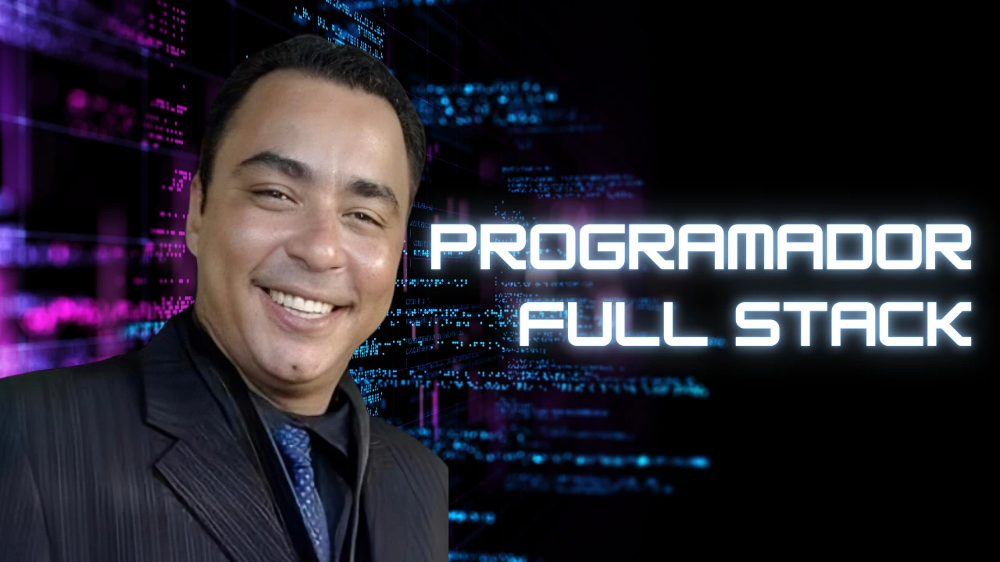
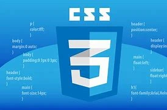
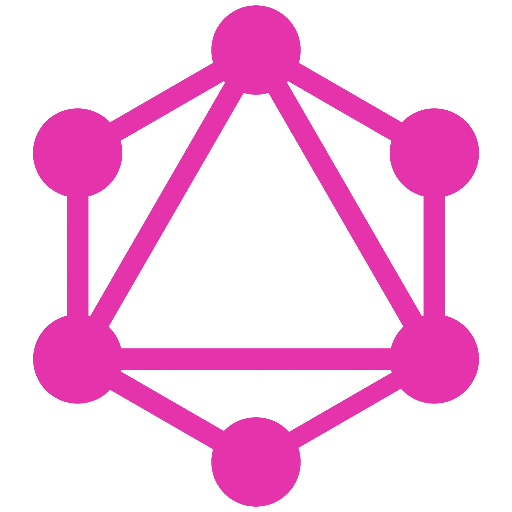
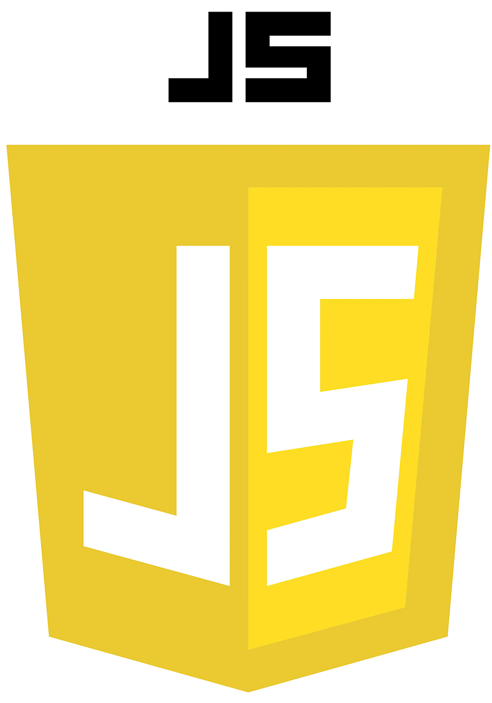
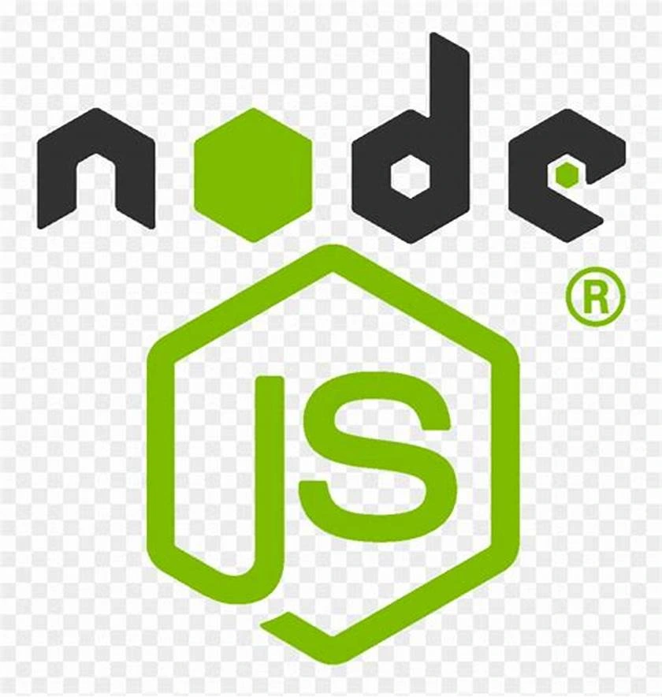
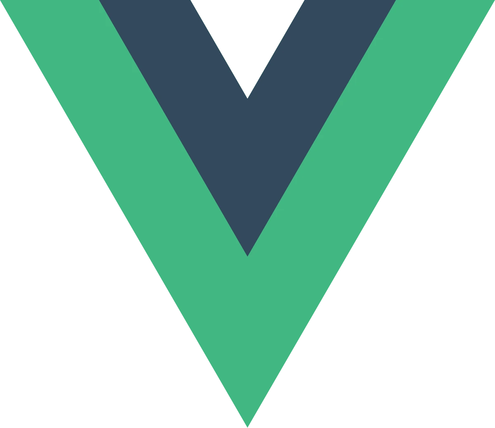
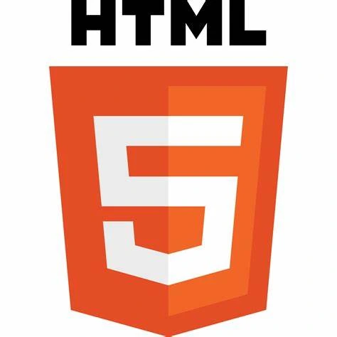
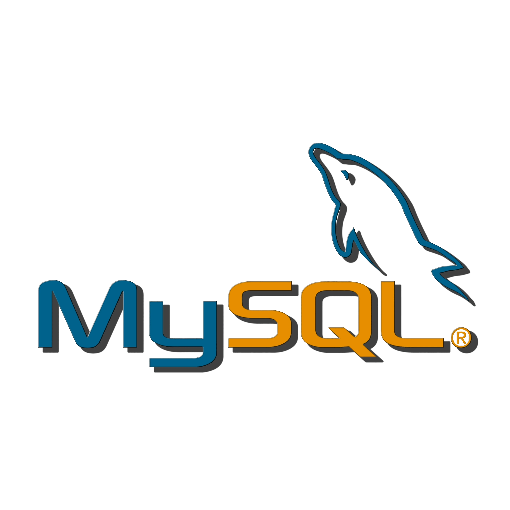

# Projeto Final de Desenvolvimento Full Stack

## Nível 5: Software Sem Segurança Não Serve

- **Faculdade Estácio de Sá**
- **Curso:** Desenvolvimento Full Stack
- **Aluno:** João Luiz Silva Tavares

---
---



**João Luiz Silva Tavares**  
Durante dois anos de estudo na Faculdade Estácio de Sá, desenvolvi habilidades que me permitem criar sistemas seguros, com foco na proteção de dados e no controle de acesso robusto.

---

## <a id="tecnologias_utilizadas"></a>Tecnologias Utilizadas

<div style="width: 100%; overflow-x: auto; margin: 20px 0;">
  <div style="display: flex; gap: 10px;">
    
    
    
    
    
    
    
     
  </div>
</div>

---

## <a id="introducao"></a>Introdução

- **Este projeto implementa um sistema Full Stack focado em segurança de dados, controle de acesso e prevenção de vulnerabilidades. A API gerencia informações de clientes e integra GraphQL para consultas e manipulações eficientes de dados, com Apollo Server. A segurança é reforçada por autenticação JWT para acesso restrito e bcrypt para criptografar senhas, alinhando-se às melhores práticas.**:
- **O projeto utiliza bibliotecas essenciais para um sistema seguro e eficiente. No backend, e posui as seguintes dependencias:**

# Iniciar o Projeto

# Backend
 

## Iniciar Projeto

```
npm init
```

### Node.js**: Plataforma principal.

```
https://nodejs.org/pt
```
### GraphQL com Apollo Server: Consultas eficientes e seguras.
```
npm install apollo-server graphql
```
### Knex.js: Query Builder SQL.
```
npm install knex
npm install -g knex
```
### Mysql2
```
npm install mysql2
```
### JWT: Autenticação.
```
npm install jsonwebtoken
```
## Instalar as Dependencias
```bash
npm install
npm install --legacy-peer-deps
npm audit fix --force

```
##  Criar arquivo .env Variaies de Ambiente
- Crie na raiz do projeto e insira
```
NODE_ENV=development
DB_HOST=localhost
DB_USER=root
DB_PASSWORD=12345678
DB_NAME=baseCliente
DB_PORT=3306
DB_SECRET= $2y$10$9HgMnwLBwrlqJV/jf01YDe4HatluuYRPgkpaHGhNq5W9iNdUPafpa
```
## Inicializar 
```
npm start
```
# Iniciar o Projeto

# Frontend

## Iniciar Projeto
```
npm install
npm install --legacy-peer-deps
```

### Compiles and hot-reloads for development
```
npm run serve
```

# Usuários com premisão de realizar alterações

## Master
```
email: master@jotaempresa.com,
senha: Master@123
```
## Dev
```
email: dev@jotaempresa.com,
senha: Dev@123
```
## Administrador
```
email: admin@jotaempresas.com
senha: Admin@123
```
## Usuário sem permissão
email: user@jotaempresas.com
senha: User@123
```

