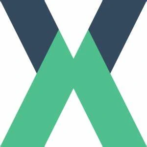

# Projeto Final de Desenvolvimento Full Stack

## Nível 5: Software Sem Segurança Não Serve

- **Faculdade Estácio de Sá**
- **Curso:** Desenvolvimento Full Stack
- **Aluno:** João Luiz Silva Tavares

## Botões de Navegação

<div style="display:flex; justify-content: space-around">
<span style="text-align: center; margin-bottom: 10px;">
    <a href="#querys" style="color:red; text-decoration:none; padding:10px; width:100px ;background-color: transparent; border: 2px solid red; border-radius: 5px; display: block;">Querys</a>
</span>

<span style="text-align: center;">
    <a href="#mutations" style="color:red; text-decoration:none; padding:10px;  width:100px; background-color: transparent; border: 2px solid red; border-radius: 5px; display: block;">Mutations</a>
</span>
</div>


**João Luiz Silva Tavares**  
Durante dois anos de estudo na Faculdade Estácio de Sá, desenvolvi habilidades que me permitem criar sistemas seguros, com foco na proteção de dados e no controle de acesso robusto.

## Tecnologias

 <div style="width: 100%; overflow-x: auto; margin: 20px 0;">
    <div style="display: flex; gap: 10px;">
      
      
      
      
      
      
      
      
    </div>
  </div>

---

# Projeto Full Stack

## Introdução

**Projeto de Desenvolvimento Full Stack - Nível 5: Software Sem Segurança Não Serve**
**Faculdade Estácio de Sá**  
**Curso**: Desenvolvimento Full Stack  
**Aluno**: João Luiz Silva Tavares

Durante dois anos de estudo na Faculdade Estácio de Sá, desenvolvi habilidades que me permitem criar sistemas seguros, com foco na proteção de dados e no controle de acesso robusto. Este projeto visa demonstrar a criação de um sistema que implementa um alto grau de segurança, com ênfase na proteção de dados sensíveis, controle de acesso robusto e práticas de desenvolvimento seguro.

## Objetivos Técnicos da Prática

### Controle Básico de Acesso a uma API REST

A implementação foi projetada com um sistema de autenticação baseado em tokens (JWT). Esse mecanismo garante que somente usuários autorizados possam acessar recursos protegidos da API, minimizando riscos de acesso não autorizado.

### Tratamento de Dados Sensíveis e Log de Erros

- **Proteção de Senhas**: Utilização de algoritmos de hashing, como `bcrypt`.
- **Log de Erros Seguros**: Configuração para não exibir informações detalhadas que possam ser exploradas por atacantes.

### Prevenção de Ameaças

- **Gerenciamento de Tokens**: Expiração automática e renovação segura para mitigar riscos de uso de tokens comprometidos.
- **Proteção Contra SQL Injection**: Uso de bibliotecas como `knex` para consultas parametrizadas.
- **Sanitização de Entradas**: Implementação de técnicas de sanitização para evitar injeções CRLF.
- **Proteção Contra CSRF**: Utilização de tokens de validação específicos para requisições críticas.

## Tecnologias e Frameworks Utilizados

### Backend

- **Node.js**: Plataforma principal de desenvolvimento.
- **GraphQL**: Eficiência no retorno de dados e maior flexibilidade.
- **Knex.js**: Query Builder para facilitar o uso do SQL.
- **JWT**: Autenticação robusta.

### Frontend

- **Vue.js**: Framework de front-end.
- **Vuetify**: Biblioteca para design responsivo.

## Querys

### Consultar Todos Usuários

```graphql
query {
  usuarios {
    id
    nome
    email
    perfil {
      nome
      rotulo
    }
    status
    dataCriacao
  }
}
```

### Consultar Usuários por ID

```graphql
query {
  usuarioID(id: 1) {
    id
    nome
    email
    status
    perfil {
      id
      nome
      rotulo
    }
    dataCriacao
  }
}
```

## Mutations

### Login do Usuário

```graphql
mutation {
  loginUsuario(
    dados: { email: "master@jotaempresa.com", senha: "Master@123" }
  ) {
    id
    nome
    email
    status
    perfil {
      nome
      rotulo
    }
  }
}
```

### Cadastrar Usuários

```graphql
mutation {
  novoUsuario(
    user: {
      nome: "dev"
      email: "dev41@dev.com"
      senha: "123"
      perfil: 4
      status: "ATIVO"
    }
  ) {
    id
    nome
    email
    perfil {
      nome
      rotulo
    }
    status
  }
}
```

### Alterar Usuários

```graphql
mutation {
  alterarUsuario(
    user: {
      nome: "brasil2"
      email: "dev1000@dev.com"
      status: "ATIVO"
      perfil: 3
    }
    filtro: { id: 42 }
  ) {
    id
    nome
    email
    status
    perfil {
      id
      nome
      rotulo
    }
  }
}
```

### Excluir Usuários

```graphql
mutation {
  excluirUsuario(filtro: { id: 2 }) {
    nome
    id
    email
    status
    dataCriacao
    perfil {
      nome
      rotulo
    }
  }
}
```

© 2024 João Luiz Silva Tavares
